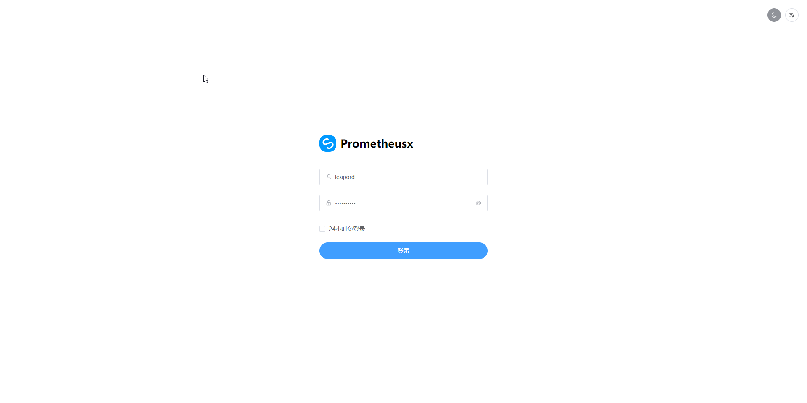
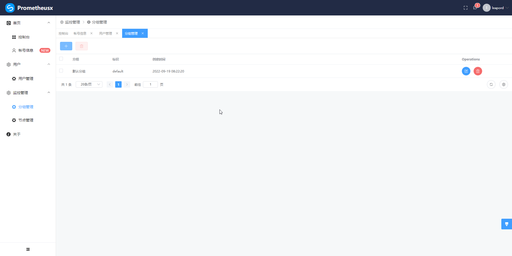
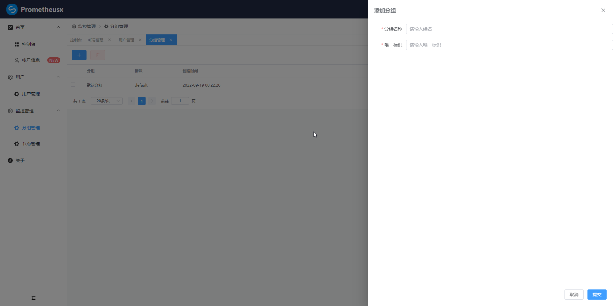
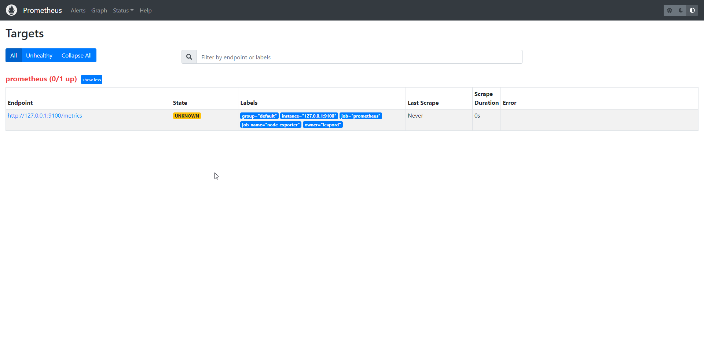
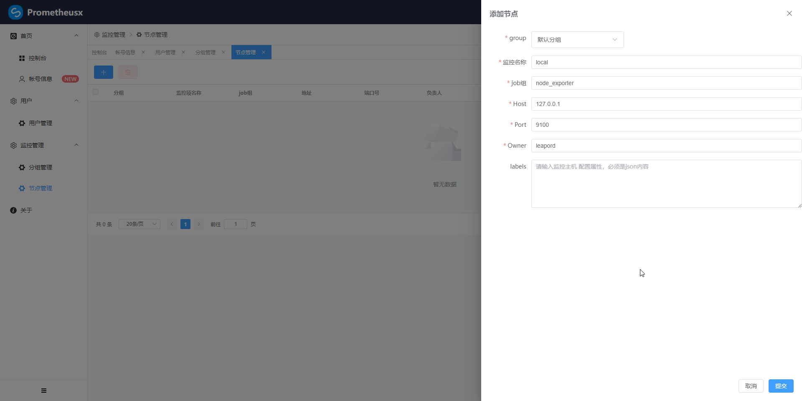
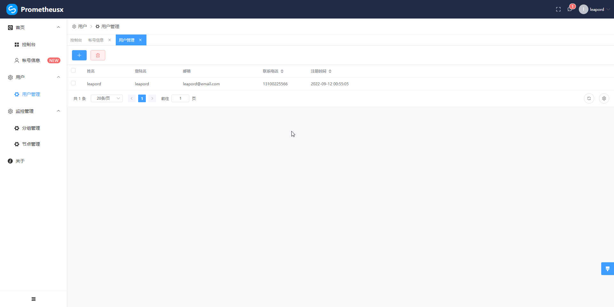
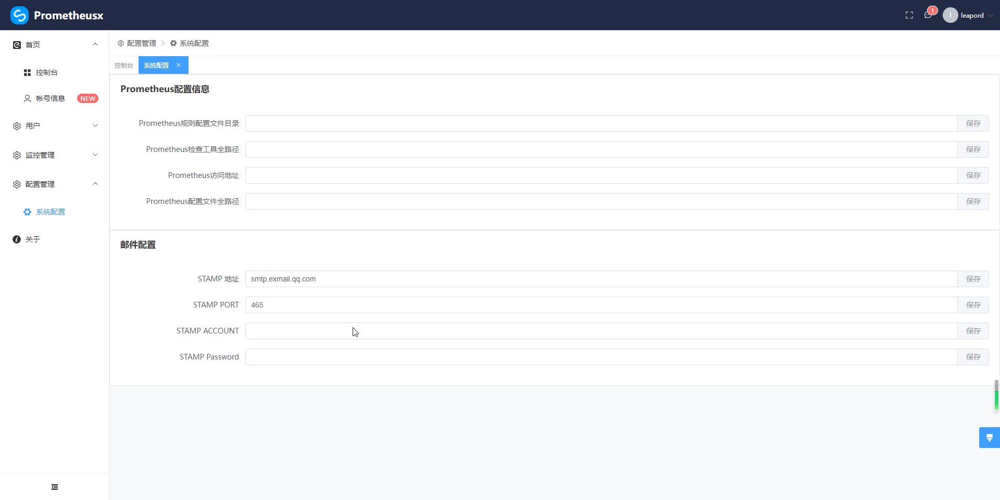
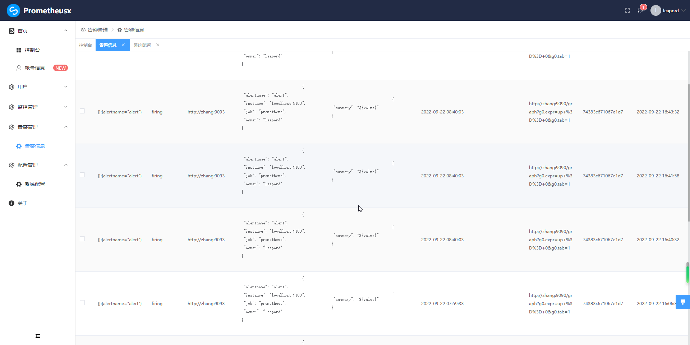

# prometheusx

    prometheus x 是基于 prometheus http_sd 监控项发现方式实现的增强组件，提供基本的scrape_configs 配置管理，规则管理等，用于替换繁琐的配置文件配置方式

提供三大主要能力，减少prometheus维护成本

1、配置管理 基于http_sd

2、告警规则管理，一键自动生成规则文件，并自动访问 /-/reload  api 加载配置文件

3、告警管理，根据alertmanager中webhook方式，实现告警消息本地储存和发送电子邮件；自动发送邮件必须有labels.owner属性

关键API

```shell
http://promethuesxAddres/api/node/target  # http_sd 访问主要地址
http://promethuesxAddres/api/alert/webhook # alertmanager中 webhook主要地址
```

## 开发

* 环境配置
  
  > go 1.18
  > 
  > goframe 2.x
  > 
  > gf-cli 2.x
  > 
  > mysql 5.7+
  > 
  > vscode go 或者 goland
  
  golang安装 [golang]([Downloads - The Go Programming Language (google.cn)](https://golang.google.cn/dl/))

​       goframe2.0安装 [GoFrame]([快速开始 - GoFrame (ZH)-v2.x - GoFrame官网 - 类似PHP-Laravel, Java-SpringBoot的Go企业级开发框架](https://goframe.org/pages/viewpage.action?pageId=1114399))

​       mysql 安装及配置[mysql]([MySQL 8.0手动安装 | Leapord](https://leapord.github.io/2022/08/30/mysql/))

​        vscode或者goland，个人喜好，有经济实力者可使用正版goland

* golang环境配置

```shell
go env -W GO111MODULE=on
# 建议将缓存等目录配置到C盘以外的目录中
go env -W GOMODCACHE=D:\develop\env\golocal\modcache
go env -W GOPROXY=https://proxy.golang.com.cn,direct
go env -W GOCACHE=D:\develop\env\golocal\cache
# 指定GOBIN 后一定要将GOBIN目录配置到环境变量中
go env -W GOBIN=D:\develop\env\Go\bin # 一般不建议改动
```

* gf-cli文件检查

```shell
gf version
```

显示结果

```shell
GoFrame CLI Tool v2.1.4, https://goframe.org
GoFrame Version: cannot find go.mod
CLI Installed At: D:\develop\env\Go\bin\gf.exe
CLI Built Detail:
  Go Version:  go1.17.13
  GF Version:  v2.1.4
  Git Commit:  2022-08-26 15:45:41 a0619f7ff0e1d7766884e3062d1b3b0947c87da4
  Build Time:  2022-08-26 15:51:38
```

* 下载代码
  
  prometheusx工具采用前后端分离的方式开发，您需要下载[prometheusx](https://github.com/leapord/prometheusx.git) 和 [prometheusx-web](https://github.com/leapord/prometheusx-web.git) 两个代码仓

​    后端技术栈

​        GoFrame v2.1.4

​        golang-jwt v4.4.2

​    前端技术栈

​        SCUI v1.6.6 （vue3 element-plus） 

   后端

```shell
git clone https://github.com/leapord/prometheusx.git
```

首先需要创建 数据库 prometheusx

```sql
create database prometheus
```

执行 db目录中的create_table.sql文件，项目工程完全参照GoFrame工程开发规范 [工程目录设计 - GoFrame (ZH)-v2.x - GoFrame官网 - 类似PHP-Laravel, Java-SpringBoot的Go企业级开发框架](https://goframe.org/pages/viewpage.action?pageId=30740166)

前端 

```shell
git clone https://github.com/leapord/prometheusx-web.git
```

切换到代码目录 执行

```shell
npm install
```

* 打包

前端 直接执行 npm build

后端

 将前端打包后的文件拷贝到 resource/public/html 目录中，注意是dist中的文件而不是将dist目录拷贝

切换到prometheusx代码根目录执行命令 gf build 所有的 打包结果都在 temp目录中

## 部署

* 启动

复制prometheusx执行文件放置任意目录中，在prometheusx同级目录中创建 config目录并且将 manifest/config/config.yaml拷贝，或者创建 config.yaml,并且添加以下内容

```yaml
# 服务器启动信息
server:
  address: ":8000"
  openapiPath: "/api.json"
  swaggerPath: "/swagger"

# 数据库连接信息
database:
  default:
    type: "mysql"
    link: "root:root@tcp(127.0.0.1:3306)/prometheusx"
    debug: true
# 开发环境，生产环境直接注释或者删除，开发环境没有登录控制
# profile:
#   active: dev

# 日志配置
logger:
  path:                  "/var/log/"   # 日志文件路径。默认为空，表示关闭，仅输出到终端
  file:                  "{Y-m-d}.log" # 日志文件格式。默认为"{Y-m-d}.log"
  prefix:                ""            # 日志内容输出前缀。默认为空
  level:                 "all"         # 日志输出级别
  ctxKeys:               []            # 自定义Context上下文变量名称，自动打印Context的变量到日志中。默认为空
  header:                true          # 是否打印日志的头信息。默认true
  stdout:                true          # 日志是否同时输出到终端。默认true
  rotateSize:            0             # 按照日志文件大小对文件进行滚动切分。默认为0，表示关闭滚动切分特性
  rotateExpire:          0             # 按照日志文件时间间隔对文件滚动切分。默认为0，表示关闭滚动切分特性
  rotateBackupLimit:     0             # 按照切分的文件数量清理切分文件，当滚动切分特性开启时有效。默认为0，表示不备份，切分则删除
  rotateBackupExpire:    0             # 按照切分的文件有效期清理切分文件，当滚动切分特性开启时有效。默认为0，表示不备份，切分则删除
  rotateBackupCompress:  0             # 滚动切分文件的压缩比（0-9）。默认为0，表示不压缩
  rotateCheckInterval:   "1h"          # 滚动切分的时间检测间隔，一般不需要设置。默认为1小时
  stdoutColorDisabled:   false         # 关闭终端的颜色打印。默认开启
  writerColorEnable:     false         # 日志文件是否带上颜色。默认false，表示不带颜色
```

* 配置prometheus相关文件地址 [v1.1功能，暂未完成]

待补充

* prometheus配置文件设置

```yaml
# my global config
global:
  scrape_interval: 15s # Set the scrape interval to every 15 seconds. Default is every 1 minute.
  evaluation_interval: 15s # Evaluate rules every 15 seconds. The default is every 1 minute.
  # scrape_timeout is set to the global default (10s).

# Alertmanager configuration
alerting:
  alertmanagers:
    - static_configs:
        - targets:
          # - alertmanager:9093

# Load rules once and periodically evaluate them according to the global 'evaluation_interval'.
rule_files:
  # - "first_rules.yml"
  # - "second_rules.yml"
  - "rules/*.yml"

# A scrape configuration containing exactly one endpoint to scrape:
# Here it's Prometheus itself.
scrape_configs:
  # 此项是连接 prometheusx关键 
  - job_name: "prometheus"
    http_sd_configs:
     - url: http://localhost:8000/api/node/target
```

* alertmanager.yml 配置

```yaml
route:
  group_by: ['alertname']
  group_wait: 30s
  group_interval: 1m
  repeat_interval: 1m
  receiver: 'web.hook'
receivers:
  - name: 'web.hook'
    webhook_configs:
        # prometheusx 中的webhookAPI地址
      - url: 'http://127.0.0.1:8000/api/alert/webhook'
inhibit_rules:
  - source_match:
      severity: 'critical'
    target_match:
      severity: 'warning'
    equal: ['alertname', 'dev', 'instance']
```

## 功能展示



分组管理





节点管理





用户管理



配置管理



告警管理


